# Wyrwyk - Implicit Curve Rasterizer
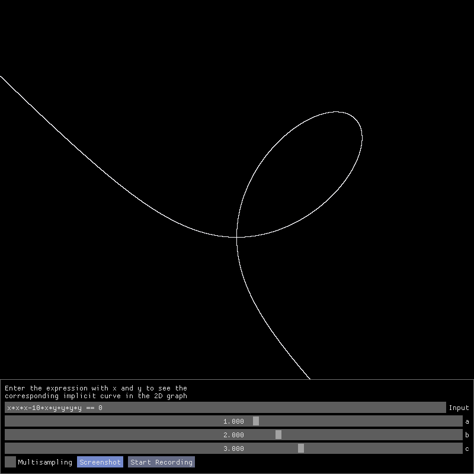

## Table of contents
* [Theory](#theory)
* [Requirements](#requirements)
* [Building and running executable](#building-and-running-executable)
* [Gallery](#gallery)

## Theory

Implicit curve is a curve in a plane defined by a relation of the form R(x, y) = 0, where R is a function of two coordinate variables.

### Example

We want to show the graph y * y + x * x = 1.

We rearrange the equation a bit so that it has the form R (x, y) = 0.

y * y + x * x - 1 = 0

So R is of the form R(x, y) = y * y + x * x - 1.

If we would like to draw a three-dimensional plot z = y * y + x * x - 1, where z is the height, we will create a three-dimensional parabola called paraboloid with the vertex below the point (0, 0, 0).

We are only interested when z = 0, so it is a plane at height 0 and its intersection with the paraboloid creates a curve we call circle.

## Requirements

### [CMake](https://cmake.org/) >= 3.11

### [GLEW](http://glew.sourceforge.net/) - The OpenGL Extension Wrangler Library

```shell
sudo apt-get install libglew-dev
```

Documentation: http://glew.sourceforge.net/basic.html

### [GLFW](https://www.glfw.org/) - Graphics Library Framework

```shell
sudo apt-get install libglfw3-dev
```

Documentation: https://www.glfw.org/documentation.html

## Building and running executable
```shell
git submodule update --init --recursive
mkdir build
cd build
cmake -G "Unix Makefiles" ..
make
./wyrwyk
```

## Gallery

### Fan
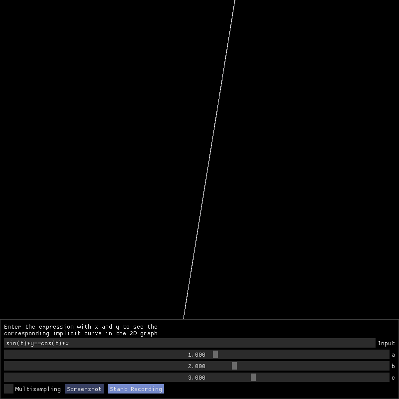

```
sin(t)*y == cos(t)*x
```

### Parametrized
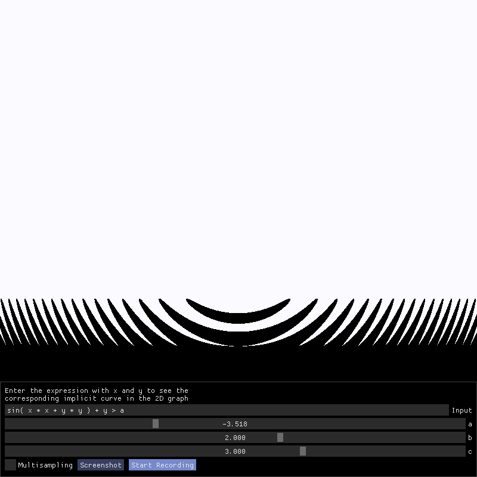

```
sin(x*x+y*y)+y > a
```

### Parabola rotation

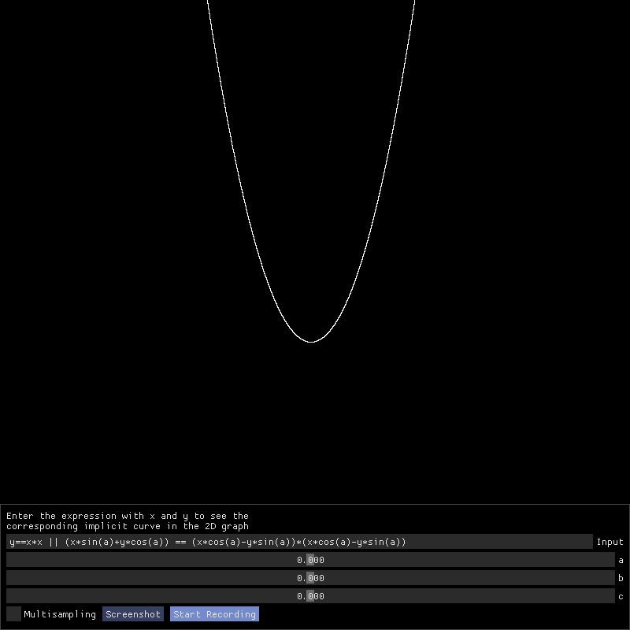

```
y == x*x || (x*sin(a)+y*cos(a)) == (x*cos(a)-y*sin(a))*(x*cos(a)-y*sin(a))
```

### Phased sinus
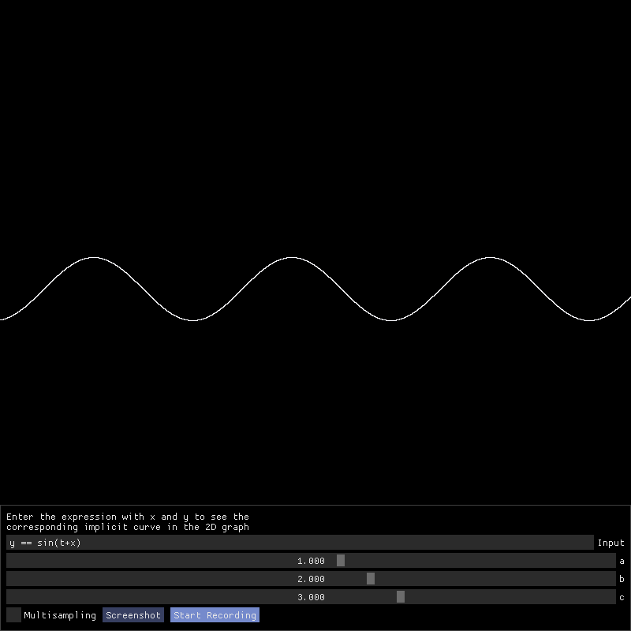

```
y == sin(t+x)
```

### Spiral
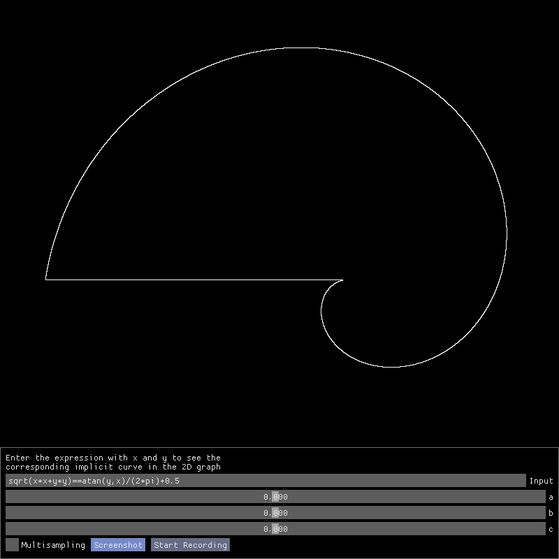

```
sqrt(x*x+y*y) == atan(y,x)/(2*pi)+0.5
```

### Phonograph disc
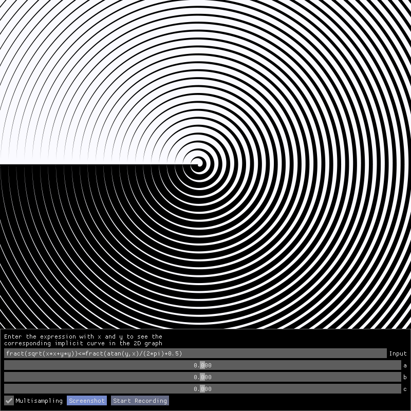

```
fract(sqrt(x*x+y*y)) <= fract(atan(y,x)/(2*pi)+0.5)
```

### Loop


```
x*x*x-10*x*y+y*y*y == 0
```

### Labyrinth
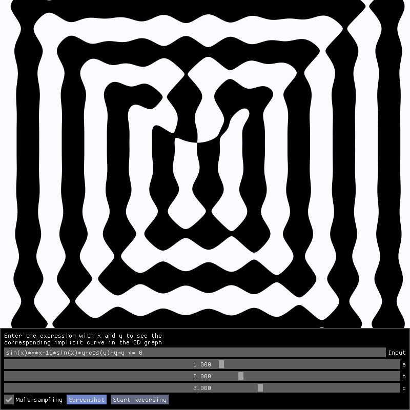

```
sin(x)*x*x-10*sin(x)*y+cos(y)*y*y <= 0
```

### Yin Yang
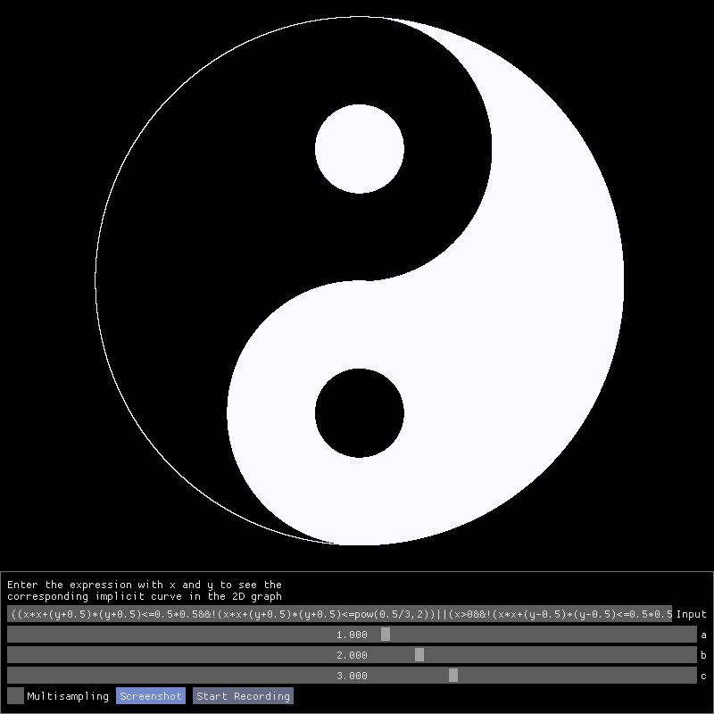

```
((x*x+(y+0.5)*(y+0.5)<=0.5*0.5&&!(x*x+(y+0.5)*(y+0.5)<=pow(0.5/3,2))||(x>0&&!(x*x+(y-0.5)*(y-0.5)<=0.5*0.5)&&!(x*x+(y+0.5)*(y+0.5)<=pow(0.5/3,2)))||x*x+(y-0.5)*(y-0.5)<=pow(0.5/3,2)||x*x+y*y==1))&&x*x+y*y<=1
```

### Tiles
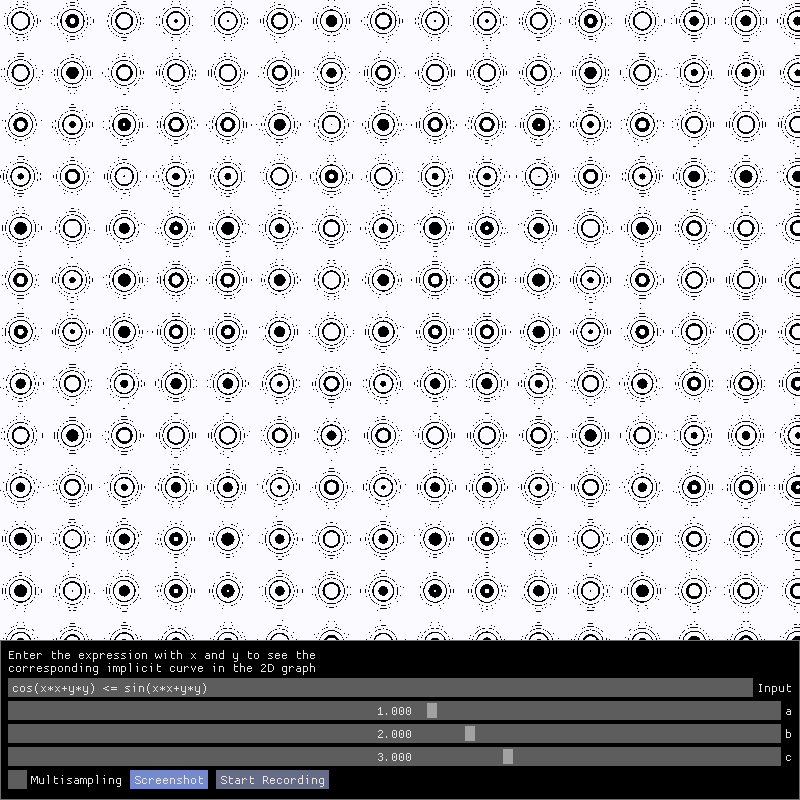

```
cos(x*x+y*y) <= sin(x*x+y*y)
```

### Onion
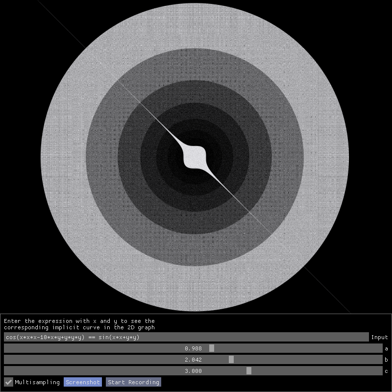

```
cos(x*x*x-10*x*y+y*y*y) == sin(x*x+y*y)
```

### Tiles 2
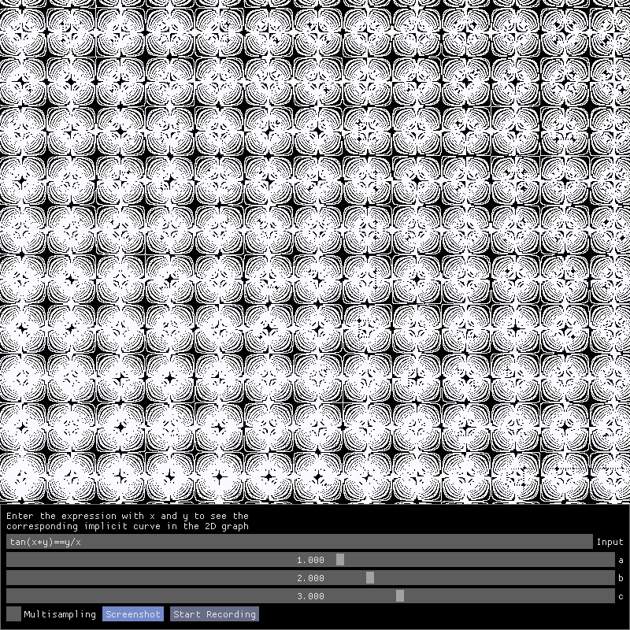

```
tan(x*y) == y/x
```

### Batman
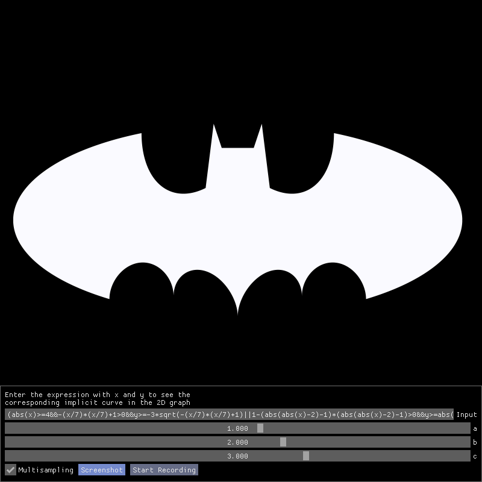

```
(abs(x)>=4&&-(x/7)*(x/7)+1>0&&y>=-3*sqrt(-(x/7)*(x/7)+1)||1-(abs(abs(x)-2)-1)*(abs(abs(x)-2)-1)>0&&y>=abs(x/2)-(3*sqrt(33)-7)/112*x*x+sqrt(1-(abs(abs(x)-2)-1)*(abs(abs(x)-2)-1))-3)&&(abs(x)>=3&&-(x/7)*(x/7)+1>0&&y<=3*sqrt(-(x/7)*(x/7)+1)||abs(x)>=0.75&&abs(x)<1&&y<=9-8*abs(x)||abs(x)>=0.5&&abs(x)<0.75&&y<=3*abs(x)+0.75||abs(x)<=0.5&&y<=2.25||abs(x)>=1&&3-x*x+2*abs(x)>0&&y<=1.5-0.5*abs(x)-6*sqrt(10)/14*(sqrt(3-x*x+2*abs(x))-2))
```

## See more
* [Wikipedia's gallery of curves](https://en.wikipedia.org/wiki/Gallery_of_curves)
* [Wikipedia's list of curves](https://en.wikipedia.org/wiki/List_of_curves)
* [Xah Math's Visual Dictionary of Special Plane Curves](http://xahlee.info/SpecialPlaneCurves_dir/specialPlaneCurves.html)