# Wyrwyk - Implicit Curve Rasterizer
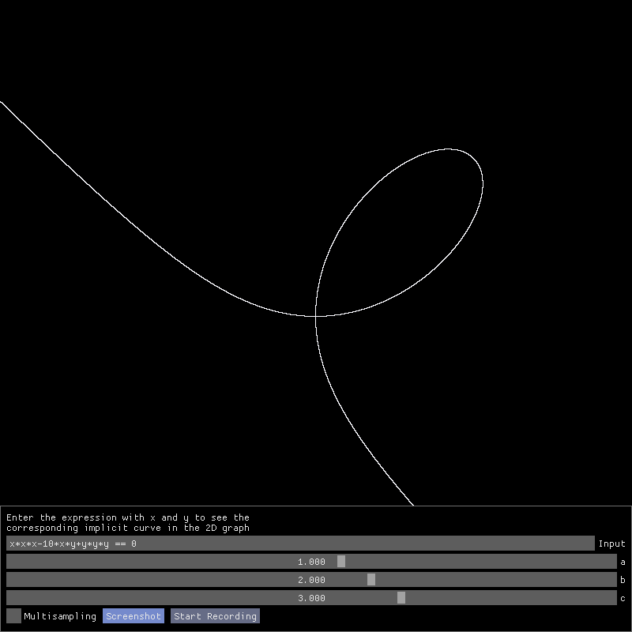

## Table of contents
* [Theory](#theory)
* [Requirements](#requirements)
* [Building and running executable](#building-and-running-executable)
* [Gallery](#gallery)

## Theory

Implicit curve is a curve in a plane defined by a relation of the form R(x, y) = 0, where R is a function of two coordinate variables.

### Example

We want to show the graph y * y + x * x = 1.

We rearrange the equation a bit so that it has the form R (x, y) = 0.

y * y + x * x - 1 = 0

So R is of the form R(x, y) = y * y + x * x - 1.

If we would like to draw a three-dimensional plot z = y * y + x * x - 1, where z is the height, we will create a three-dimensional parabola called paraboloid with the vertex below the point (0, 0, 0).

We are only interested when z = 0, so it is a plane at height 0 and its intersection with the paraboloid creates a curve we call circle.

## Requirements

* C++17 compiler - GCC 9+, Clang 10+, MSVC 2019+ or Apple Clang (Xcode 12+)
* [CMake](https://cmake.org/) >= 3.16
* [Git](https://git-scm.com/) - used by CMake to download dependencies
* Graphics driver supporting OpenGL 3.3 core profile

Libraries are downloaded and built automatically during CMake configuration, nothing has to be installed manually:

* [GLFW](https://www.glfw.org/) - window, OpenGL context and input (system installation is used when available, otherwise 3.5.1 is downloaded)
* [Dear ImGui](https://github.com/ocornut/imgui) 1.92.9b - GUI

Bundled in `contrib`:

* [glad](https://github.com/Dav1dde/glad) - OpenGL 3.3 core loader
* [stb_image_write](https://github.com/nothings/stb) - saving screenshots

### Linux

Debian / Ubuntu:

```shell
sudo apt-get install build-essential cmake git libglfw3-dev
```

Fedora:

```shell
sudo dnf install gcc-c++ cmake git glfw-devel
```

Arch Linux:

```shell
sudo pacman -S base-devel cmake git glfw
```

Without system GLFW it is built from source, which additionally requires X11 and Wayland development packages, e.g. on Debian / Ubuntu:

```shell
sudo apt-get install libx11-dev libxrandr-dev libxinerama-dev libxcursor-dev libxi-dev libwayland-dev libxkbcommon-dev wayland-protocols
```

### Windows

Install [Visual Studio](https://visualstudio.microsoft.com/) with the "Desktop development with C++" workload, it contains CMake. Git has to be installed separately.

### macOS

```shell
xcode-select --install
brew install cmake
```

## Building and running executable

The same commands work on every platform:

```shell
cmake -S . -B build -DCMAKE_BUILD_TYPE=Release
cmake --build build --config Release
```

The executable is placed in `build` (or `build/Release` for Visual Studio and Xcode generators) together with the `res` directory it needs:

```shell
./build/wyrwyk               # Linux, macOS
build\Release\wyrwyk.exe     # Windows
```

The executable can be started from any directory. Copy it together with the `res` directory to move it elsewhere, or use `cmake --install build --prefix <directory>`.

### Controls

* Mouse scroll - zoom
* Right mouse button drag - move
* Esc - exit

### Troubleshooting

* Errors are printed to the console, so run the executable from a terminal to see them.
* `Could not create window with OpenGL 3.3 core profile context` - update graphics drivers. In a virtual machine enable 3D acceleration.
* To force the use of GLFW downloaded and built from source add `-DWYRWYK_USE_SYSTEM_GLFW=OFF` to the first CMake command.

## Gallery

### Fan
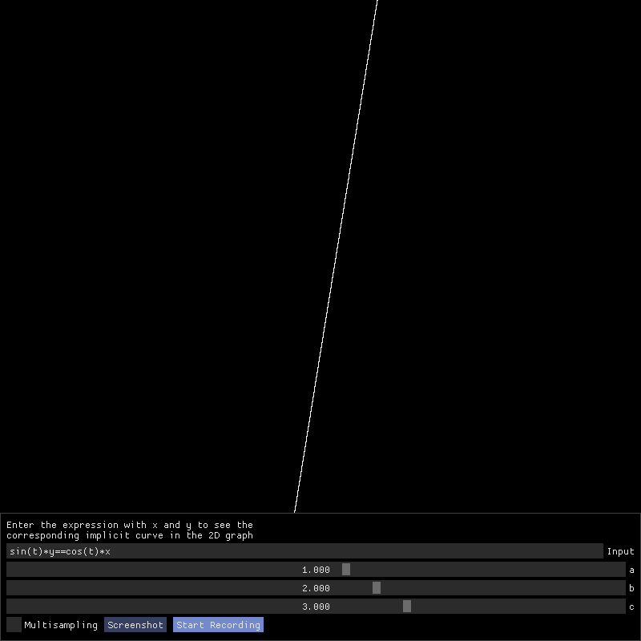

```
sin(t)*y == cos(t)*x
```

### Parametrized
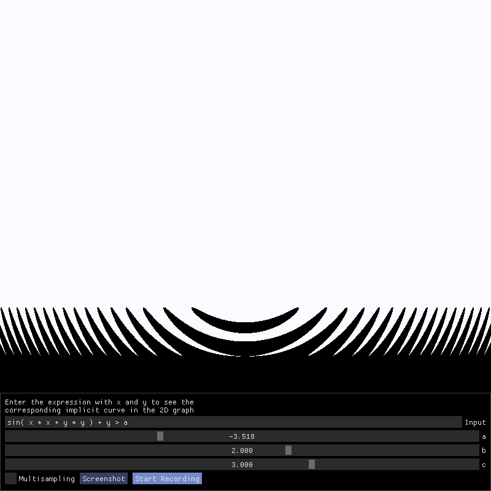

```
sin(x*x+y*y)+y > a
```

### Parabola rotation

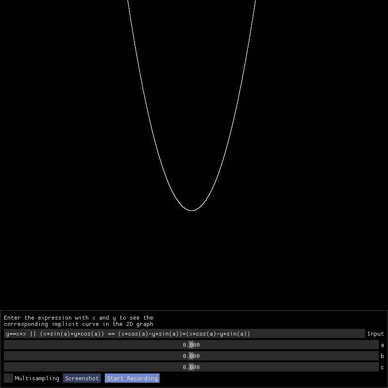

```
y == x*x || (x*sin(a)+y*cos(a)) == (x*cos(a)-y*sin(a))*(x*cos(a)-y*sin(a))
```

### Phased sinus
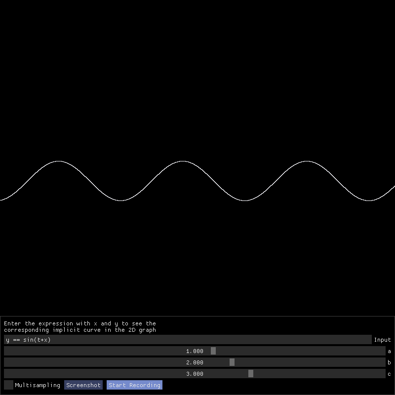

```
y == sin(t+x)
```

### Spiral
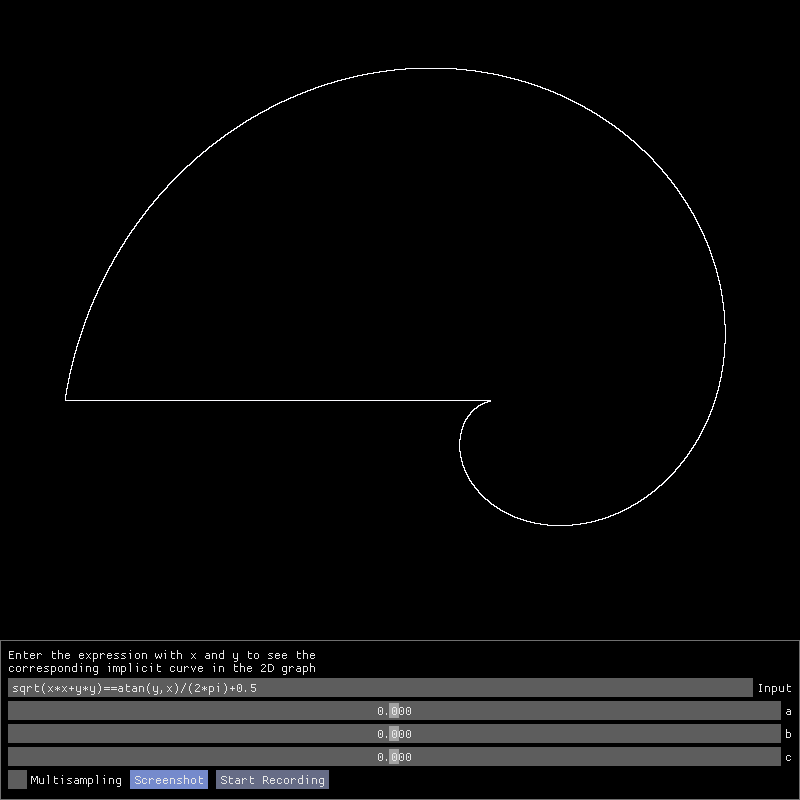

```
sqrt(x*x+y*y) == atan(y,x)/(2*pi)+0.5
```

### Phonograph disc
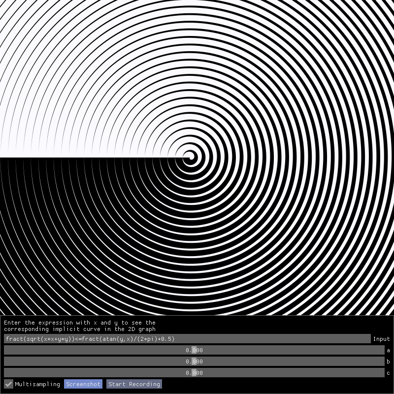

```
fract(sqrt(x*x+y*y)) <= fract(atan(y,x)/(2*pi)+0.5)
```

### Loop


```
x*x*x-10*x*y+y*y*y == 0
```

### Labyrinth
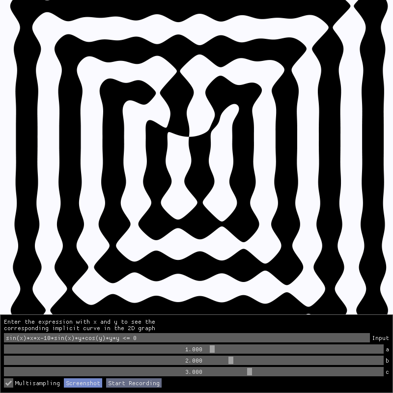

```
sin(x)*x*x-10*sin(x)*y+cos(y)*y*y <= 0
```

### Yin Yang
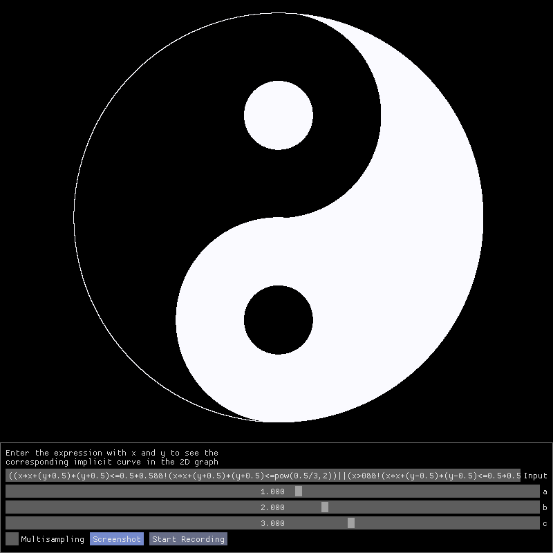

```
((x*x+(y+0.5)*(y+0.5)<=0.5*0.5&&!(x*x+(y+0.5)*(y+0.5)<=pow(0.5/3,2))||(x>0&&!(x*x+(y-0.5)*(y-0.5)<=0.5*0.5)&&!(x*x+(y+0.5)*(y+0.5)<=pow(0.5/3,2)))||x*x+(y-0.5)*(y-0.5)<=pow(0.5/3,2)||x*x+y*y==1))&&x*x+y*y<=1
```

### Tiles
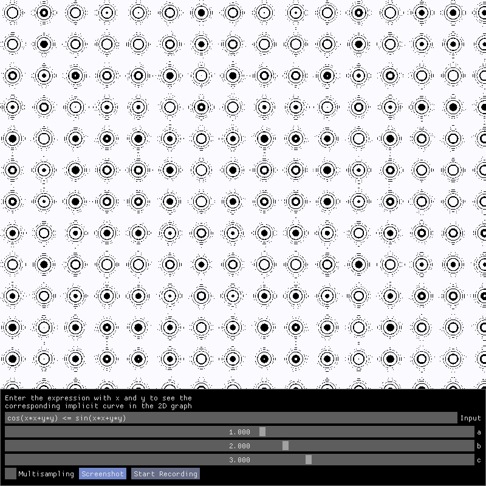

```
cos(x*x+y*y) <= sin(x*x+y*y)
```

### Onion
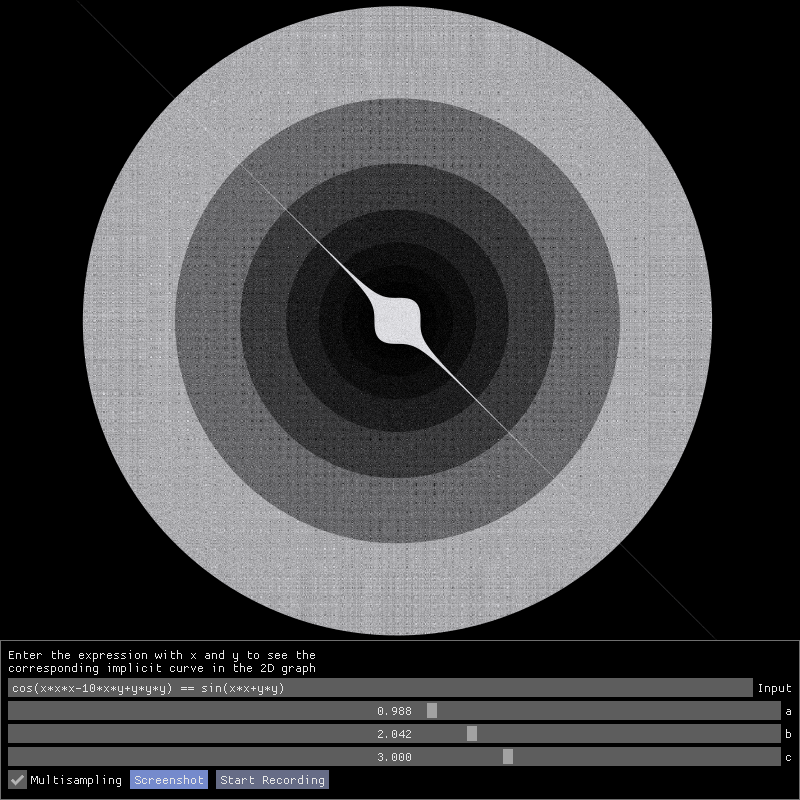

```
cos(x*x*x-10*x*y+y*y*y) == sin(x*x+y*y)
```

### Tiles 2
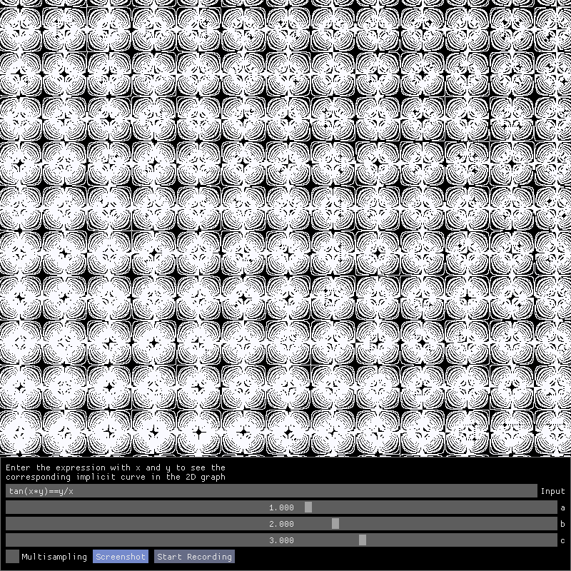

```
tan(x*y) == y/x
```

### Batman
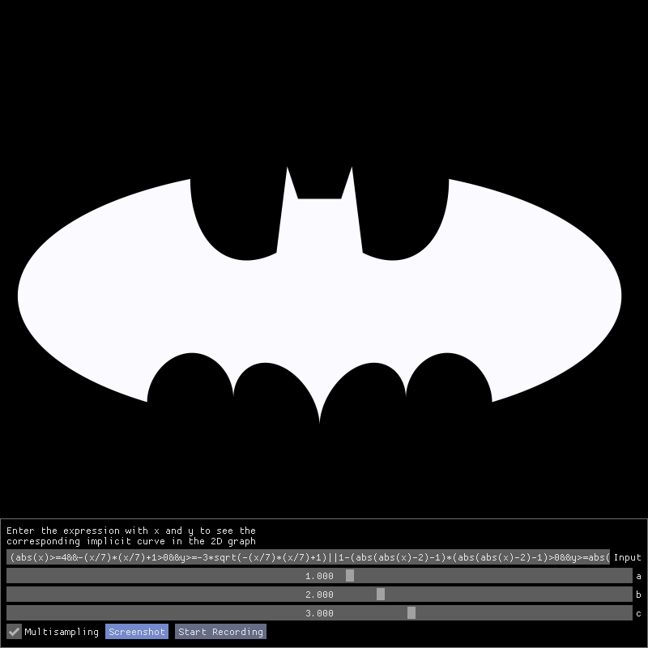

```
(abs(x)>=4&&-(x/7)*(x/7)+1>0&&y>=-3*sqrt(-(x/7)*(x/7)+1)||1-(abs(abs(x)-2)-1)*(abs(abs(x)-2)-1)>0&&y>=abs(x/2)-(3*sqrt(33)-7)/112*x*x+sqrt(1-(abs(abs(x)-2)-1)*(abs(abs(x)-2)-1))-3)&&(abs(x)>=3&&-(x/7)*(x/7)+1>0&&y<=3*sqrt(-(x/7)*(x/7)+1)||abs(x)>=0.75&&abs(x)<1&&y<=9-8*abs(x)||abs(x)>=0.5&&abs(x)<0.75&&y<=3*abs(x)+0.75||abs(x)<=0.5&&y<=2.25||abs(x)>=1&&3-x*x+2*abs(x)>0&&y<=1.5-0.5*abs(x)-6*sqrt(10)/14*(sqrt(3-x*x+2*abs(x))-2))
```

## See more
* [Wikipedia's gallery of curves](https://en.wikipedia.org/wiki/Gallery_of_curves)
* [Wikipedia's list of curves](https://en.wikipedia.org/wiki/List_of_curves)
* [Xah Math's Visual Dictionary of Special Plane Curves](http://xahlee.info/SpecialPlaneCurves_dir/specialPlaneCurves.html)